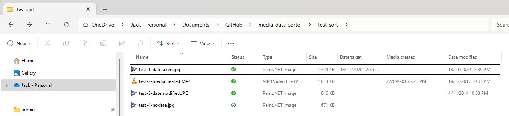
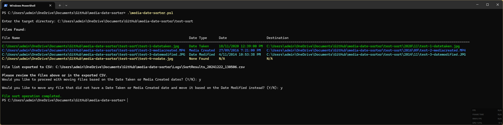
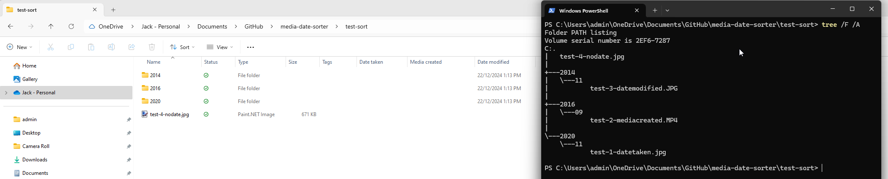

# Sort Photos and Videos by Date

After spending a bunch of time looking for some fee software or a simple way to achive this and failing I decided to have a go at it myself. I really liked the way OneDrive sorted my photos and videos with its Photo backup from my phone in to <Year>\<Month> subfolders, however I had a bunch of existing media that I wanted to quickly move and sort in the same way. After searching arround for various pieces of sofware or scripts and getting frustrated, I decided to put together this with a bit of help from AI.

A PowerShell script I put together with the help of AI to organize photos and videos into subfolders by year and month, based on the `Date taken` or `Media created` metadata properties. This script is intended for cleaning up your media library, especially if you have thousands photo and video files from various devices that you wish to organise and catalogue by year and month.

# Sort Photos and Videos by Date

After struggling to find free software or a simple solution to organise my photos and videos, I decided to build this script. I liked how OneDrive automatically sorts media from my phone into `<Year>\<Month>` subfolders and wanted to apply the same structure to a large collection of existing media files. Frustrated with existing tools and options, I created this script with a bit of help (AI).

This PowerShell script organises photos and videos into subfolders by year and month, based on the `Date Taken`, `Media Created`, or (as a fallback) `Date Modified` metadata properties. It's great for cleaning up and cataloguing media libraries, especially when dealing with thousands of files from various devices and/or sources.

## What it does

1. Prompts for a target directory to process.
2. Reads metadata properties (`Date Taken` or `Media Created`) from files and falls back to `Date Modified` if neither is available.
3. Attempts to parse the dates.
4. Skips files with no valid date metadata (`Date Taken`, `Media Created`, or `Date Modified`).
5. Displays a color-coded table of all files with their detected dates, statuses, and destinations.
6. Prompts to confirm moving files based on `Date Taken` or `Media Created`.
7. Optionally prompts to move skipped files using `Date Modified` as the fallback.
8. Moves files into `Year\Month` subfolders (e.g., `2023\12` for December 2023).
9. Exports a timestamped CSV file documenting all actions (files moved, skipped, etc.) into a `logs` subfolder.

## Requirements

- Windows PowerShell 5.1 or later.
- Access to files with **metadata properties** (`Date taken` or `Media created`).
- Administrative privileges may be required for certain directories.

## Usage

1. Clone the repository: `git clone https://github.com/jackbrumley/media-date-sorter.git`
2. Navigate to the script's directory: `cd media-date-sorter`
3. Run the script: `.\media-date-sorter.ps1` and you will be prompted for your directory or
Run the script with the path specified: `.\media-date-sorter.ps1 -TargetDirectory "C:\Users\admin\Photos\Unsorted Media"`

Follow the on-screen prompts to provide the target directory and confirm actions.

## Screenshots

